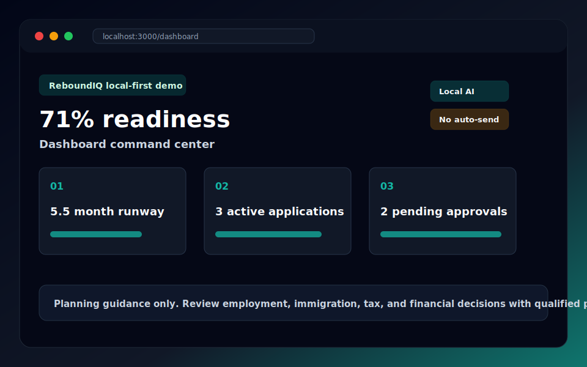
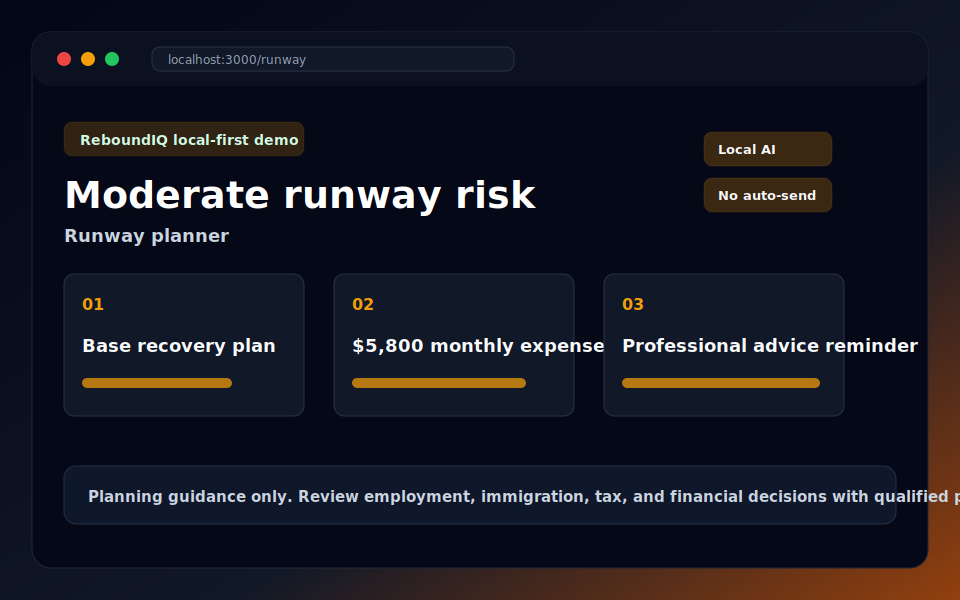
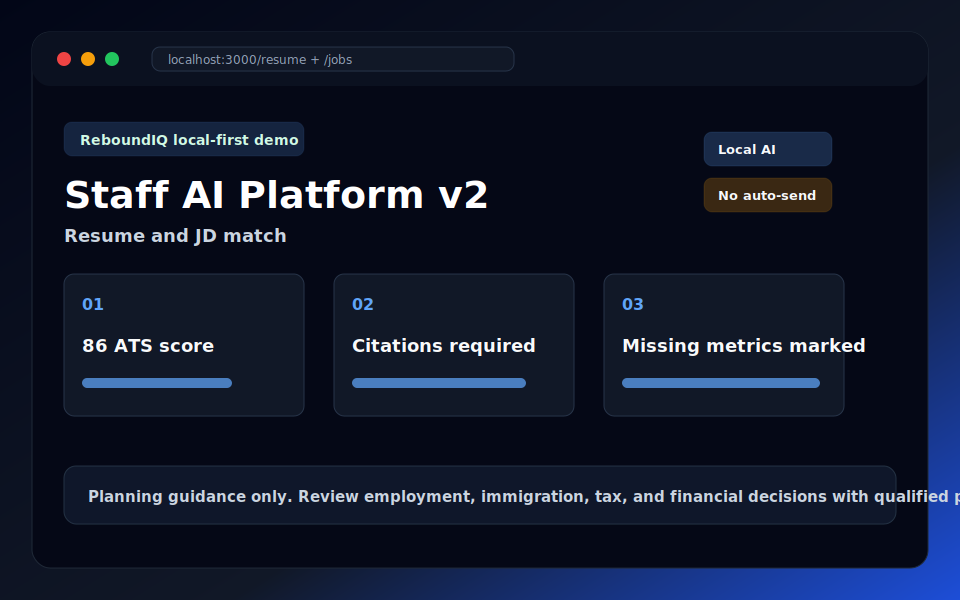
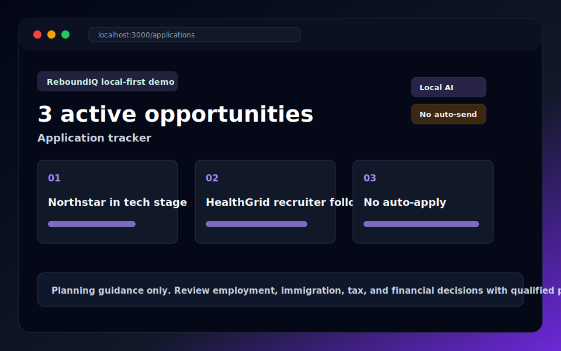
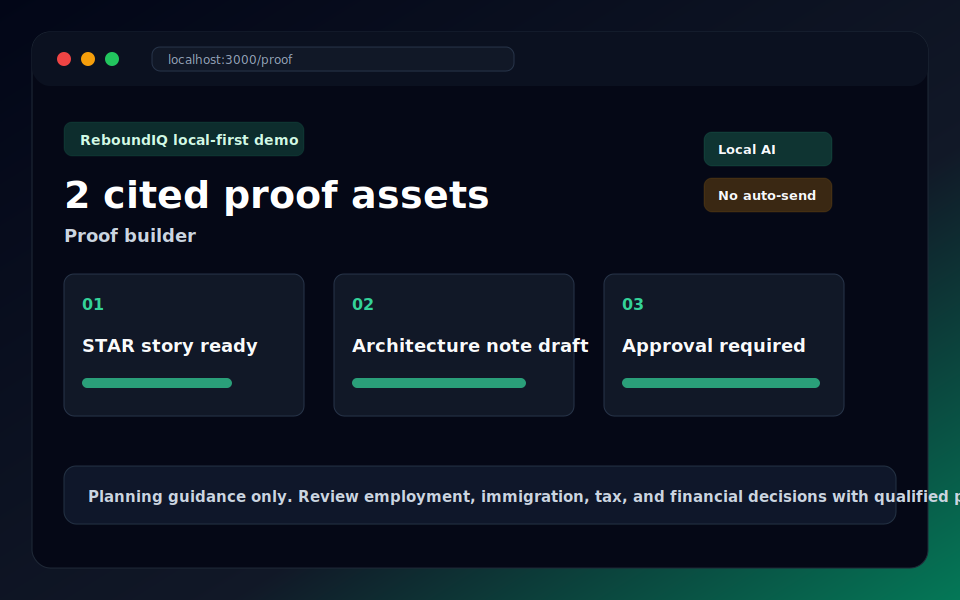
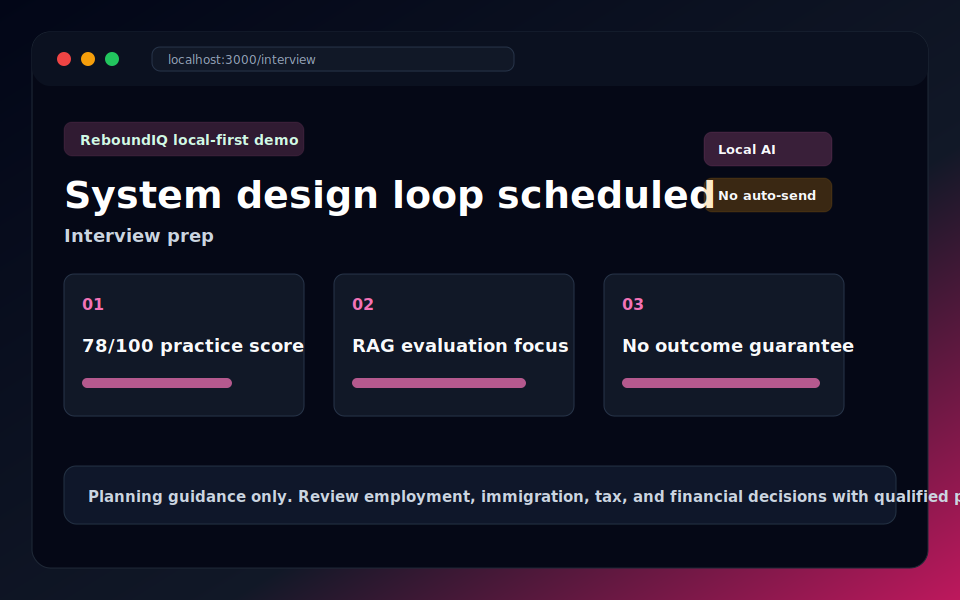
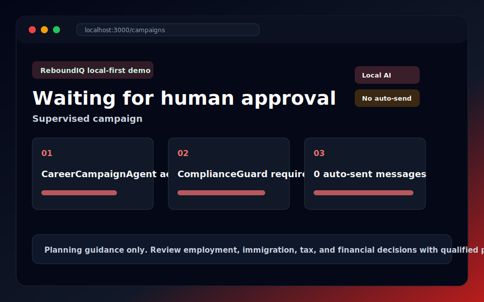
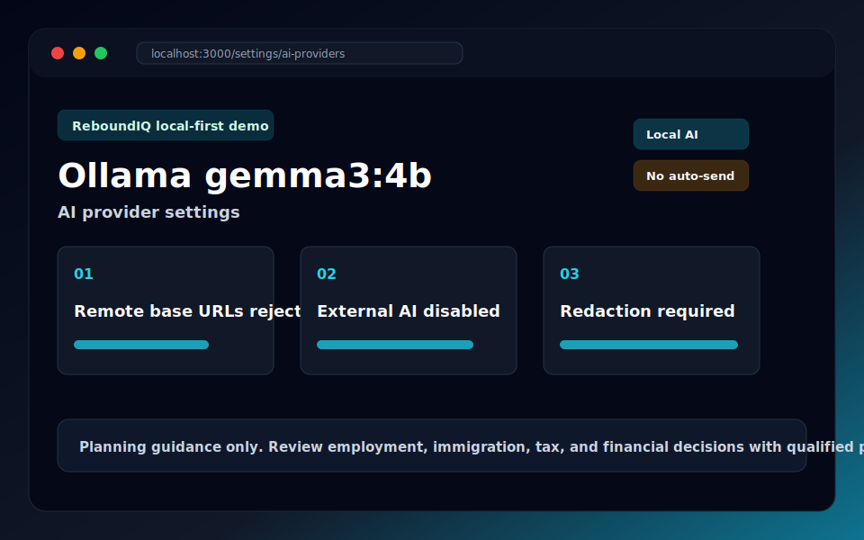
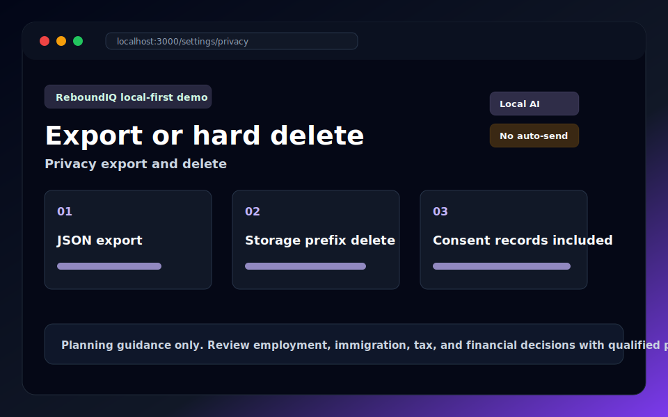

# ReboundIQ

**A local-first layoff-to-offer operating system for technical professionals.**

ReboundIQ helps laid-off or transitioning engineers, AI/data practitioners, PMs,
designers, analysts, and technical leads turn career recovery into a structured
workflow: runway planning, resume evidence, job targeting, proof-of-work,
applications, interview preparation, and supervised campaign planning.

The product is built around a simple rule: personal career data stays private by
default. Local Ollama AI is the default path, external AI is disabled until the
user opts in, and deterministic backend services remain authoritative.

## Product Promise

- **Local-first AI**: Ollama is the default provider. The app works without paid
  model APIs.
- **Privacy-first workflows**: every user-owned record is scoped by
  authenticated `user_id`; sensitive AI and memory paths require consent.
- **Evidence-based career artifacts**: resumes, proof stories, and campaign
  artifacts must be grounded in user-provided facts and citations.
- **Human control**: ReboundIQ never auto-applies, auto-sends outreach, or
  silently edits user-facing artifacts.
- **Planning guidance only**: runway, sponsorship, offer, and risk surfaces are
  guidance and risk signals, not legal, immigration, financial, tax, medical, or
  hiring advice.

## Available Now

- **Career dashboard** for the layoff-to-offer operating loop.
- **Runway planner** with persisted snapshots for expenses, savings, severance,
  unemployment assumptions, scenarios, and action items.
- **Application tracker** with authenticated records for company, role, stage,
  JD snapshot, next step, fit score, sponsorship signal, and resume version link.
- **Proof-of-work builder** with persisted STAR stories, case studies,
  architecture notes, GitHub README drafts, LinkedIn posts, citations, and
  application links.
- **Interview prep** with persisted sessions, focus areas, question logs,
  feedback, scores, scheduling, and application links.
- **Resume upload and parsing** with immutable original storage, parsed data,
  versions, private document chunks, and local embedding support.
- **JD analysis** through the AI Gateway with request IDs, user isolation, and
  groundedness/confidence signals.
- **AI provider settings** for local Ollama status, installed model discovery,
  suggested local tags, and runtime local model selection.
- **Privacy controls** for authenticated JSON data export, stored file payloads,
  consent records, and hard account deletion.
- **Supervised agent backend** for CareerCampaignAgent campaigns, typed tools,
  ComplianceGuard checks, tool-call audit logs, and human approval checkpoints.
- **Golden evals** for safety, groundedness, redaction, schema, tool fidelity,
  and campaign compliance behavior.

## Polished Local-First Demo

The demo is designed to show ReboundIQ as a career recovery product, not a
generic job tracker. It follows one synthetic persona from layoff intake to
offer decision support while keeping the local-first, privacy-first, and
planning-guidance boundaries visible at every step.

### Seeded Persona

Run `make migrate && make seed`, then log in with:

- Email: `maya.patel.demo@reboundiq.local`
- Password: `ReboundIQ-demo-2026!`

Maya Patel is a synthetic senior backend and AI platform engineer recovering
from a layoff. The seed includes a runway snapshot, parsed resume, Staff AI
Platform resume version, three applications, two proof assets, two interview
sessions, one supervised campaign, pending approval requests, consent records,
and a local AI audit sample. The source fixture is
[docs/demo/reboundiq_demo_persona.json](docs/demo/reboundiq_demo_persona.json).

### Layoff-To-Offer Journey

1. **Layoff intake**: Maya signs in, confirms local-first defaults, and sees
   that external AI and auto-actions are disabled.
2. **Runway clarity**: she captures expenses, savings, severance assumptions,
   and action items as planning guidance only.
3. **Resume evidence**: her original resume is preserved, parsed, chunked, and
   versioned with source inputs.
4. **JD targeting**: job descriptions are matched against evidence with missing
   data called out instead of fabricated.
5. **Application pipeline**: opportunities move through saved, recruiter, and
   technical stages with follow-ups and linked resume versions.
6. **Proof-of-work**: STAR stories and architecture notes are drafted from cited
   evidence and remain approval-gated.
7. **Interview readiness**: practice sessions track focus areas, feedback, and
   scores without claiming hiring outcomes.
8. **Supervised campaign**: CareerCampaignAgent coordinates typed tools and
   creates approval requests instead of auto-sending or auto-applying.
9. **Provider and privacy review**: Maya switches local Ollama tags, verifies
   external AI consent is off, exports data, and can hard-delete the account.
10. **Offer decision support**: readiness, reminders, proof, and risk signals
    help Maya prepare human decisions with qualified professional review where
    employment, immigration, tax, or financial questions matter.

### Demo Screenshots

These synthetic screenshot assets are generated from the demo fixture with
`python docs/demo/generate_screenshot_assets.py`.

| Workflow | Screenshot | What To Show |
| --- | --- | --- |
| Dashboard command center |  | Readiness, reminders, local-first posture, approval state |
| Runway planner |  | Burn-rate assumptions and planning guidance disclaimer |
| Resume and JD match |  | Source inputs, ATS-style signal, missing metrics note |
| Application tracker |  | Stage diversity, next steps, no auto-apply |
| Proof builder |  | Cited STAR story and approval-gated architecture note |
| Interview prep |  | Practice loop, focus areas, no hiring guarantee |
| Supervised campaign |  | Agent orchestration with pending human approvals |
| AI provider settings |  | Ollama model switching, external AI disabled, redaction language |
| Privacy export/delete |  | JSON export, hard delete confirmation, consent records |

### Outcome KPIs

- **Time to first credible plan**: 15 minutes in the demo script.
- **Evidence coverage**: 2 proof assets linked to active applications.
- **Pipeline health**: 3 active opportunities across saved, recruiter, and
  technical stages.
- **Human control**: 2 pending approval checkpoints and 0 auto-sent artifacts.
- **Privacy posture**: 100% local AI in seed data and 0 external AI calls.
- **Interview readiness**: 78/100 current system design practice score.

These are demo/product indicators, not promises of employment, hiring speed,
compensation, immigration outcomes, tax treatment, or financial results.

### Privacy, Consent, Export, And Delete

- External AI starts disabled at both the deployment and user-consent layers.
- Sensitive memory and visa-processing consent start disabled for the demo user.
- `/settings/ai-providers` records external consent only after the user
  acknowledges the required text; redaction and audit language remains visible.
- `/settings/privacy` downloads a JSON export covering profile, resumes,
  document chunks, agent campaigns, approvals, AI requests, consent records,
  workflow rows, audit logs, and readable stored files.
- Hard deletion requires typing `DELETE`, removes user-owned database rows, and
  deletes the `users/{user_id}` storage prefix.

### AI Provider Switching Tests

The demo keeps provider choice local by default:

- `gemma3:4b` or another pulled Ollama tag can be selected for the demo user.
- Localhost-style Ollama base URLs are accepted.
- Remote model base URLs are rejected with a local-provider bypass warning.
- External providers require explicit user consent plus the deployment-level
  `ENABLE_EXTERNAL_AI` gate.

Focused coverage lives in [apps/api/tests/test_demo_release.py](apps/api/tests/test_demo_release.py),
including local provider validation, remote URL rejection, screenshot/KPI
coverage, export/delete table coverage, and legal disclaimer checks.

### Competitive Differentiation

- Versus generic job trackers: ReboundIQ combines runway, evidence,
  applications, interviews, agent approvals, export/delete, and AI provider
  controls instead of stopping at status columns.
- Versus generic resume tools: resume versions connect to source inputs, JD
  signals, proof assets, and citations so missing evidence can be marked rather
  than invented.
- Versus cloud-first AI career assistants: local Ollama is the default, and
  external AI requires consent, redaction, and audit logging.
- Versus automation-first outreach products: agents orchestrate and request
  approval; they do not auto-apply, auto-send, or silently edit artifacts.

Use [docs/DEMO_RELEASE_CHECKLIST.md](docs/DEMO_RELEASE_CHECKLIST.md) before
recording, demoing, or shipping the local-first career recovery demo.

## Architecture

| Layer | Stack | Notes |
| --- | --- | --- |
| Web | Next.js 15 App Router, TypeScript, Tailwind | Product workflows live under `apps/web/app` with local-first fallbacks. |
| API | FastAPI, Pydantic v2, SQLAlchemy 2.0 async | Business logic lives in services; routes stay thin and authenticated. |
| Data | Postgres, pgvector, Alembic | Workflow tables, resumes, memory, audit, agents, approvals, and document chunks. |
| AI | `AIGateway`, Ollama, optional LiteLLM-compatible external providers | No business code calls providers directly. External AI requires consent and redaction. |
| Agents | LangGraph / Deep Agents patterns | Agents orchestrate deterministic typed tools and approval checkpoints. |
| Storage | `StorageService` protocol | Originals are preserved; user-isolated keys are required. |
| Evals | `make eval`, JSONL golden cases | Safety, citation, schema, redaction, groundedness, and compliance checks. |

## API Surface

Core authenticated backend routes include:

- `POST /api/v1/auth/register`, `POST /api/v1/auth/login`,
  `GET /api/v1/auth/me`
- `POST /api/v1/resumes/upload`,
  `POST /api/v1/resumes/{resume_id}/versions`, `GET /api/v1/resumes`,
  `GET /api/v1/resumes/versions`,
  `GET /api/v1/resumes/{resume_id}/versions`
- `POST /api/v1/jobs/analyze`
- `GET /api/v1/ai/status`, `GET /api/v1/ai/local-models`,
  `POST /api/v1/ai/local-models/select`,
  `POST /api/v1/ai/consent/external-ai`
- `GET|POST /api/v1/runway/snapshots`,
  `PATCH|DELETE /api/v1/runway/snapshots/{snapshot_id}`
- `GET|POST /api/v1/applications`,
  `PATCH|DELETE /api/v1/applications/{application_id}`
- `GET|POST /api/v1/proof/assets`,
  `PATCH|DELETE /api/v1/proof/assets/{asset_id}`
- `GET|POST /api/v1/interviews/sessions`,
  `PATCH|DELETE /api/v1/interviews/sessions/{session_id}`
- `GET /api/v1/privacy/export`,
  `POST /api/v1/privacy/delete-account`
- `POST /api/v1/agents/campaigns`,
  `POST /api/v1/agents/campaigns/{campaign_id}/run`,
  `GET /api/v1/agents/approvals`,
  `POST /api/v1/agents/approvals/{approval_id}/decide`

All workflow CRUD paths are deterministic and user-isolated. They do not invoke
AI, send messages, apply jobs, or generate user-facing artifacts.

## Quick Start

```powershell
git clone <your-fork-or-repo> ReboundIQ
cd ReboundIQ

Copy-Item .env.example .env

# Full local stack: Postgres + pgvector, Redis, Ollama, MinIO, API, web
make dev

# Apply schema and seed synthetic demo data
make migrate
make seed
```

Open:

- Web app: http://localhost:3000
- API docs: http://localhost:8000/docs
- API health: http://localhost:8000/health
- MinIO console: http://localhost:9001

First Ollama boot can take several minutes while local models are pulled. See
[docs/LOCAL_AI_SETUP.md](docs/LOCAL_AI_SETUP.md) for Windows, WSL2, Docker
Desktop, and CPU model notes.

## Local Development

```bash
make backend    # FastAPI only
make frontend   # Next.js only
make migrate    # Alembic upgrade head
make test       # Backend pytest + frontend check target
make lint       # Ruff, mypy, eslint, prettier
make eval       # Golden safety/eval suite
make down       # Stop and remove local compose volumes
```

Useful direct commands:

```bash
cd apps/api && python -m pytest tests -q
cd apps/api && alembic heads
cd apps/web && npm run build
```

## Safety Model

ReboundIQ treats career AI as a high-trust surface:

- external AI is off by default;
- redaction is required before any external call;
- external consent is persisted per user in consent records;
- all AI requests flow through `AIGateway`;
- ComplianceGuard runs on generation paths;
- user-facing artifacts require human approval checkpoints;
- personal claims require citations or explicit missing-data language;
- memory is evidence only and never overrides current user input or safety rules;
- every service query must filter by authenticated `user_id`;
- AI requests, agent tool calls, memory events, and actions are auditable.

See [AGENTS.md](AGENTS.md) and [docs/AGENT_BACKEND.md](docs/AGENT_BACKEND.md)
for the implementation rules that coding agents and contributors must preserve.

## Repository Map

```text
.
├── apps/
│   ├── api/                 # FastAPI backend
│   │   ├── app/
│   │   │   ├── ai/          # AIGateway, redaction, memory
│   │   │   ├── agents/      # supervised campaign orchestration
│   │   │   ├── api/v1/      # HTTP routes
│   │   │   ├── models/      # SQLAlchemy models
│   │   │   ├── schemas/     # Pydantic API contracts
│   │   │   └── services/    # deterministic business logic
│   │   ├── alembic/         # migrations
│   │   └── tests/           # backend tests
│   └── web/                 # Next.js frontend
├── docs/                    # product, setup, agent, and feature docs
├── infra/                   # Docker/Postgres initialization
├── tests/evals/goldens/     # safety and groundedness eval fixtures
├── docker-compose.yml
├── Makefile
└── AGENTS.md
```

## Documentation

- [User Guide](docs/USER_GUIDE.md)
- [Local AI Setup](docs/LOCAL_AI_SETUP.md)
- [Agent Backend](docs/AGENT_BACKEND.md)
- [Feature Slice Notes](docs/FEATURE_SLICE_2026_06_18.md)
- [Demo Release Checklist](docs/DEMO_RELEASE_CHECKLIST.md)
- [Demo Persona Fixture](docs/demo/reboundiq_demo_persona.json)
- [Agent Guidelines](AGENTS.md)

## Roadmap

- Persist per-user local AI preferences instead of process-local runtime
  selection.
- Add reminder scheduling and notification delivery for application next steps.
- Expand proof, interview, outreach, and campaign generation only through
  `AIGateway`, redaction, ComplianceGuard, citations, eval cases, and human
  approval.
- Add production deployment hardening: rate limits, RLS policies, encryption for
  optional sensitive fields, backups, and operational dashboards.

## License

MIT. See [LICENSE](LICENSE).

**Review everything. Use AI as planning support, not as a substitute for human
judgment or professional advice.**
