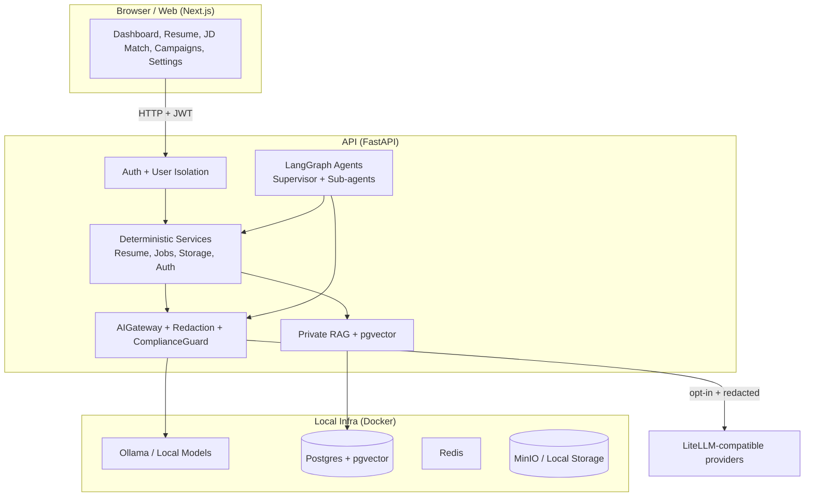
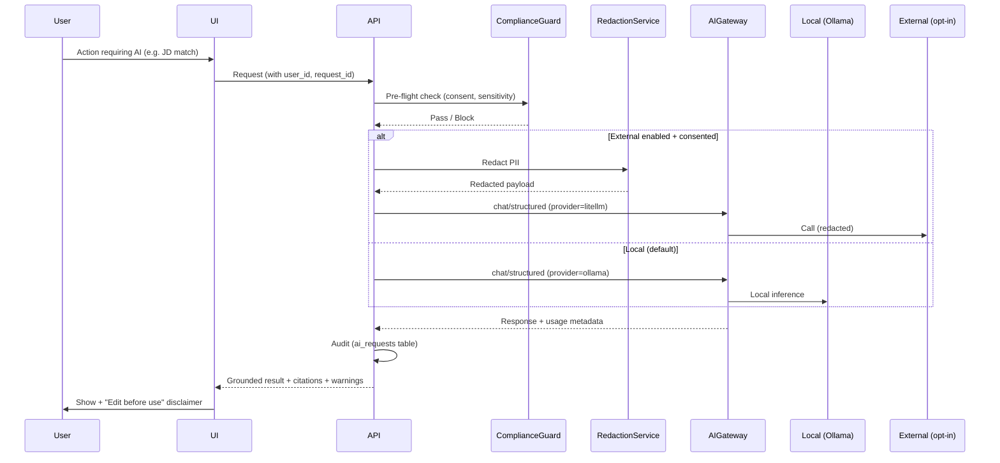
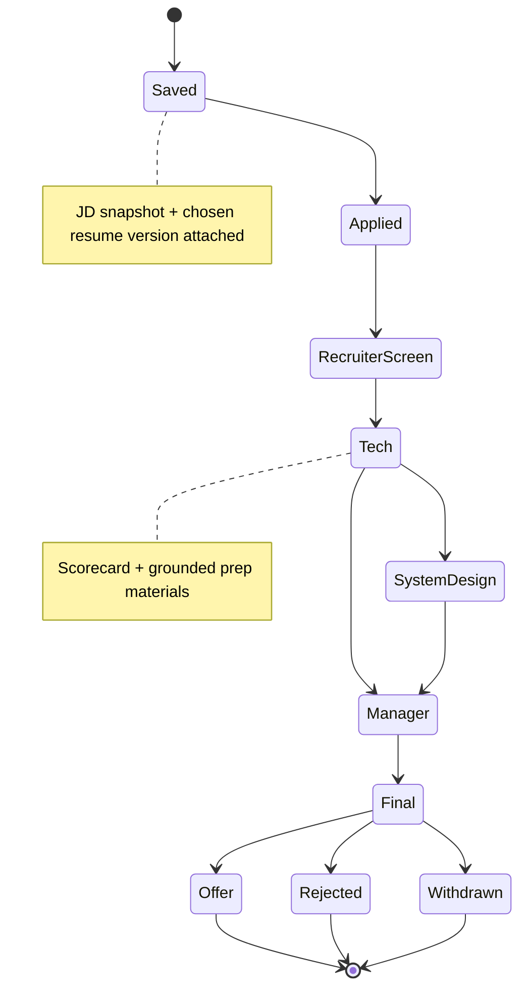
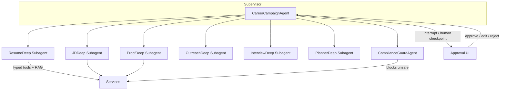

# ReboundIQ User Guide

**Privacy-first, local-first AI career recovery copilot.**  
From layoff to structured execution: runway planning, resume intelligence, JD matching, proof building, application tracking, outreach, interview prep, and deep agent campaigns.

> **Important**: This provides **planning guidance and risk signals only**. It is not legal, immigration, financial, tax, or medical advice. All AI output must be reviewed and edited by a human before use. Never send unedited AI drafts.

## Table of Contents
- [Getting Started](#getting-started)
- [Core Concepts](#core-concepts)
- [UI Overview & Navigation](#ui-overview--navigation)
- [Key Workflows](#key-workflows)
  - [Resume Intelligence](#resume-intelligence)
  - [Runway Planning](#runway-planning)
  - [JD Analysis & Matching](#jd-analysis--matching)
  - [Application Tracking](#application-tracking)
  - [Proof-of-Work Builder](#proof-of-work-builder)
  - [Interview Prep](#interview-prep)
  - [Deep Agent Campaigns](#deep-agent-campaigns)
  - [AI Providers & Consent](#ai-providers--consent)
  - [Privacy & Data Control](#privacy--data-control)
- [Mermaid Diagrams](#mermaid-diagrams)
- [Best Practices & Safety](#best-practices--safety)
- [Troubleshooting](#troubleshooting)

## Getting Started

### Prerequisites
- Docker + Docker Compose (recommended)
- 8GB+ RAM (Ollama models use memory)
- Git

### Quick Start (Docker)
```bash
# Clone
git clone https://github.com/your-org/ReboundIQ.git
cd ReboundIQ

# Setup env
cp .env.example .env
# Edit .env if you want to change ports or models

# Start everything (Postgres+pgvector, Redis, Ollama, MinIO, API, worker, web)
make dev
# or
docker compose up --build -d
```

On first run:
- Ollama will download small models (llama3.2:1b + nomic-embed-text). This can take 5-15 minutes.
- Wait for services healthy: `docker compose ps`
- Seed demo data (synthetic, no real PII): `make seed`

Access:
- **Web UI**: http://localhost:3000 (starts at `/` → redirects to dashboard or onboarding)
- **API Docs**: http://localhost:8000/docs
- **MinIO Console** (for uploaded files): http://localhost:9001 (user: `reboundiq`, pass from `.env.example`)

Login creates or reuses a JWT-backed local user. Records are scoped to the authenticated user.

See `docs/LOCAL_AI_SETUP.md` for Windows/WSL2, GPU, non-Docker, and model tips.

### Makefile Shortcuts
```bash
make dev      # full stack
make down     # stop (add -v to remove volumes)
make seed     # load demo data
make migrate  # run DB migrations
```

## Core Concepts

- **Local AI Default**: Everything works with Ollama on your machine. No data leaves unless you explicitly consent to external providers.
- **Consent & Redaction Gate**: External AI is **disabled** by default. When you enable it, you must provide explicit consent text. All PII is redacted before any external call.
- **Grounded Outputs**: AI responses cite sources from *your* uploaded resumes, JDs, or private knowledge base. If data is missing, it says so.
- **Human Approval for Agents**: Deep agent campaigns (for complex multi-step work) include checkpoints where you review and approve artifacts before they are "final".
- **Never Auto-Apply / Auto-Send**: The system generates drafts and plans only. You control sending, applying, and editing.
- **Versioned & Immutable Storage**: Original uploads are never overwritten. All versions and artifacts are traceable.

## UI Overview & Navigation

Top nav (always visible):
- **Dashboard** — Overview, progress, risk signals, quick actions, weekly plan.
- **Runway** — Scenario-based cash runway planner with planning disclaimers.
- **Resume** — Upload, parse, create role-targeted versions.
- **JD Match** — Paste job descriptions for extraction + evidence-based matching.
- **Applications** — Authenticated pipeline with JD snapshots, scorecards, and follow-up signals.
- **Proof** — Evidence-first proof assets such as STAR stories, READMEs, and architecture narratives.
- **Interview** — Question drills, evidence checklist, self-score, and persisted practice history.
- **Campaigns** — Launch deep agent workflows (supervisor + sub-agents for resume overhaul, outreach batches, etc.).
- **AI Settings** — Provider status, toggle external AI + record consent.
- **Privacy** — Consent records, data export/delete controls.

Footer always reminds: *Planning guidance only. Not legal/financial/immigration advice.*

Runway, application, proof, and interview records are persisted through authenticated API-backed workflows.

## Key Workflows

### Resume Intelligence
1. Go to **Resume**.
2. Choose a file (PDF, DOCX, or TXT).
3. Click **Upload & Parse (local AI)** — runs local parsing + structured extraction.
4. Enter target role (e.g. "AI Engineer", "Staff Backend Engineer").
5. Click **Create {role} Version** — generates a tailored version with bullets/summary suggestions grounded in your text.
6. Review the `content_json` output. Edit heavily before using.

**Storage**: Originals go to user-isolated paths in local storage (or MinIO in Docker). Versions are separate records.

Version history is visible in the UI. Future enhancements include side-by-side diff, ATS scoring breakdown, export to PDF/Markdown, and richer RAG citations from your private KB.

### JD Analysis & Matching
1. Go to **JD Match**.
2. Paste the full job description.
3. Click **Analyze JD & Generate Match (local AI)**.
4. Results include:
   - Match score (0-100, evidence-based)
   - Required vs missing skills
   - Seniority, domain, red flags, sponsorship clues
   - Rewrite strategy for your materials
   - Recruiter message draft + cover letter starting point
   - Citations (which parts of JD drove each claim)

Upload or select a stored resume/resume version before expecting personal fit claims. Without evidence, ReboundIQ reports missing evidence instead of inferring your background.

**Safety**: All drafts contain warnings. Edit out any overclaims.

### Runway Planning
Go to **Runway**.

- Enter cash, severance, expected transition income, monthly expenses, debt minimums, one-time costs, and contingency.
- Review Conservative, Moderate, and Lean runway scenarios.
- Use the checklist to identify documents, deadlines, and assumptions that need verification.

**Safety**: This page provides planning guidance and risk signals only. It is not financial, legal, immigration, tax, or medical advice.

### Application Tracking
Go to **Applications**.

- Add opportunities with company, role, fit score, JD snapshot, next step, resume version link, sponsorship signal, and notes.
- Move records across Saved, Applied, Recruiter, Tech, System Design, Manager, Final, Offer, Rejected, and Withdrawn.
- Use scorecards and follow-up due signals to decide what needs attention.

Application records are stored in the backend with authenticated user isolation and action-audit logging.

Manual only — no auto-apply.

### Proof-of-Work Builder
Go to **Proof**.

- Choose STAR story, architecture narrative, GitHub README, or LinkedIn post.
- Fill in evidence, situation, task, action, result, metrics, and citations.
- Save proof assets to the authenticated proof library.

Missing evidence stays visible in the draft instead of being inferred.

### Interview Prep
Go to **Interview**.

- Select Behavioral, System Design, AI/RAG, Backend, or Leadership.
- Practice with question prompts, expected evidence, likely follow-ups, and answer notes.
- Use the checklist and sliders to save a persisted practice score.

Scores are practice signals only, not hiring predictions.

### Deep Agent Campaigns
Go to **Campaigns**.

This is the "deep work" layer powered by LangGraph:
- A supervisor (`CareerCampaignAgent`) breaks down large goals (e.g., "Overhaul my materials for Staff+ AI roles").
- Sub-agents (ResumeDeep, JDDeep, ProofDeep, etc.) execute deterministic steps using typed tools.
- Human approval checkpoints before artifacts are saved/applied.
- Optional hindsight memory to learn from real outcomes (callbacks, rejections, interviews).

Current slice: supervised campaign cockpit with approval statuses and workflow stages. Full supervisor + 7 sub-agents + memory integration follow the design plan.

### AI Providers & Consent
Go to **AI Settings**.

- View current provider (Ollama by default), local models, and status.
- Select an installed local Ollama model, choose a suggested local tag, or type a custom local tag.
- Example local chat tags include `llama3.2:1b`, `gemma3:4b`, `gemma2:9b`, `mistral:7b`, `qwen2.5:7b`, and `phi3:mini`.
- Run the provider test after changing models.
- Toggle **External AI**:
  1. Read the disclaimer.
  2. Type or edit the consent acknowledgment.
  3. Enable.
- Every external call is:
  - Pre-checked by ComplianceGuardAgent
  - PII-redacted (RedactionService)
  - Fully audited (ai_requests table + logs with `request_id`)

You can disable external at any time. Local mode remains fully functional.

Test connection buttons help verify Ollama or your LiteLLM proxy.

### Privacy & Data Control
Go to **Privacy**.

- View external-AI consent status.
- Export your data as a JSON archive with structured records, consent history,
  and readable stored file payloads encoded for portability.
- Hard delete account + all artifacts (cascades where appropriate).

All user data is isolated by `user_id`. Row-level checks are enforced in services.

## Mermaid Diagrams

### 1. High-Level Architecture



### 2. Resume Upload & Versioning Flow

```mermaid
flowchart TD
    A[User selects PDF/DOCX/TXT] --> B[POST /resumes/upload]
    B --> C[StorageService saves original<br/>never deleted]
    C --> D[Local parse + gateway.structured extraction]
    D --> E[Save Resume record + parsed_json]
    E --> F[User chooses target role]
    F --> G[POST /resumes/{id}/versions]
    G --> H[gateway + grounded rewrite suggestions]
    H --> I[Save ResumeVersion + content_json + ats_score]
    I --> J[User reviews + edits before use]
    J --> K[Link version to applications / campaigns]
```

### 3. AI Request Lifecycle (Consent + Safety)



### 4. Application Pipeline (State Machine)



### 5. Deep Agent Campaign Overview



## Best Practices & Safety

- **Always edit AI drafts** — remove any claims you cannot personally verify with evidence.
- **Start with local AI** — switch to external only when you have explicit need and have recorded consent.
- **Use citations** — every generated claim should trace back to something you uploaded or wrote.
- **Version everything** — keep the original resume sacred. Create new versions for each target role.
- **Manual outreach & applications** — the system helps you prepare; you decide what to send.
- **Review risk signals weekly** on the dashboard and adjust your plan.
- **Export your data regularly** if you want a backup.
- **Hindsight Memory** (when enabled): Only opt-in per category and review reflections before they influence future plans.

## Troubleshooting

- **Ollama not responding**: `docker compose logs ollama` or `docker compose exec ollama ollama list`. Re-pull models if needed.
- **"External disabled" errors**: Go to AI Settings and record consent (or stay on local — it's fully capable).
- **Upload fails**: Check file type (pdf/docx/txt only in current slice) and size. Look at API logs.
- **Slow responses**: Use smaller local models (llama3.2:1b or 3b) for dev. Larger models are better but slower on CPU.
- **Missing features**: Many pages note "stub" or "full in later PR". This is an incremental vertical slice following a 20+ PR plan.
- **DB / migration issues**: `make migrate`. For clean slate: `docker compose down -v && make dev`.

For developer setup, architecture, or contributing, see:
- `README.md`
- `docs/LOCAL_AI_SETUP.md`
- `AGENTS.md`
- `Makefile`

**Review everything. Ground your own career decisions in reality, not AI output.**

---

*This guide reflects the current vertical slice. Full features (complete kanban, RAG citations in UI, full agent campaigns with approval UI, offer/negotiation tools, visa mode, hindsight memory dashboard, evals in UI, etc.) are delivered incrementally per the design plan.*
